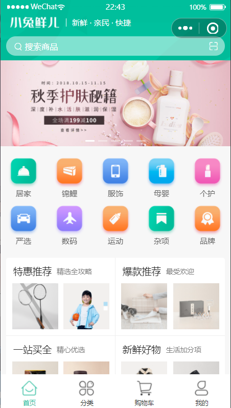
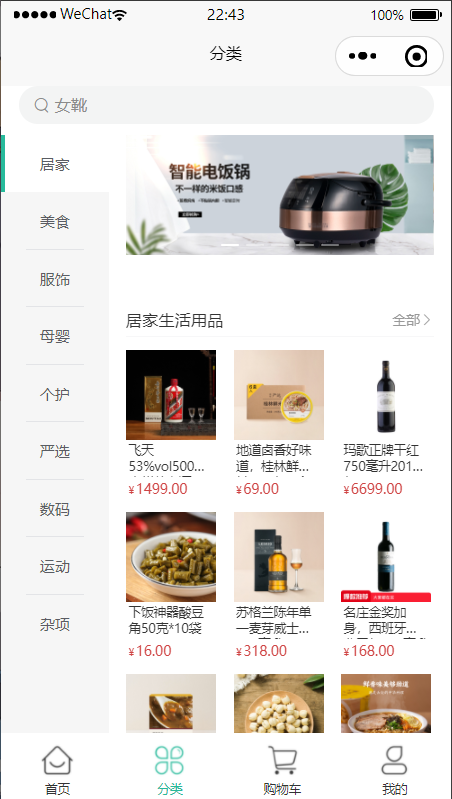

# 黑马程序员-小兔鲜儿商城小程序

## 项目信息

- 技术栈：vue3 + uni-app + TypeScript
- 开发环境：HBuilderX、vscode (主要插件: Volar, uni-helper, uni-create-view, uniapp小程序扩展)

## 预览图

<table border="0">
 <tr>
	<td>
        </img>    
	</td>
	<td>
		</img>   
	 </td>
	<td>
		</img>
	</td>
 </tr>
</table>
